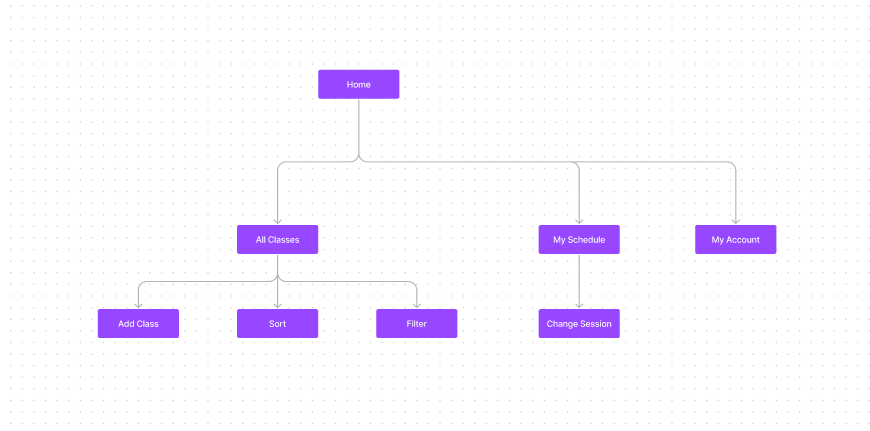
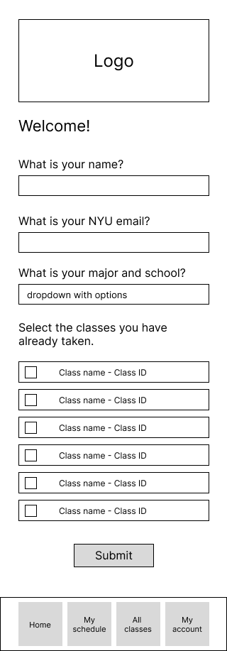
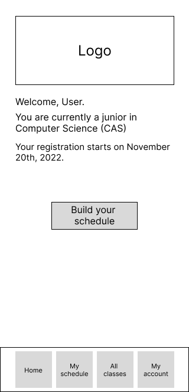
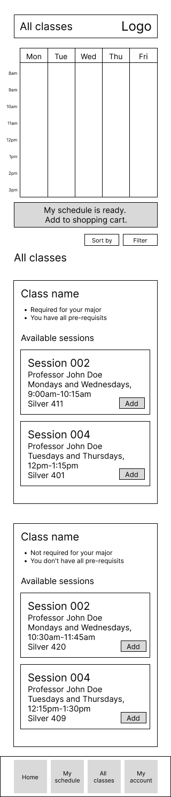
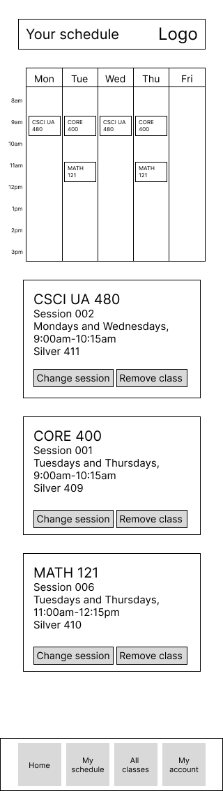
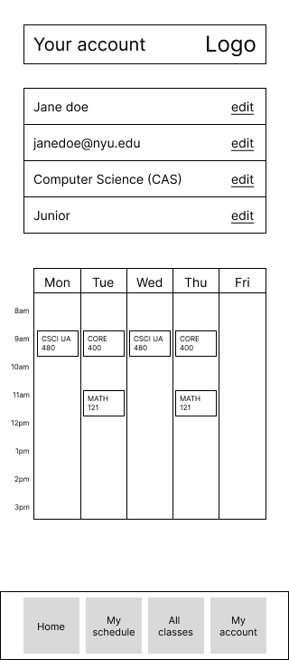

# User Experience Design

## Prototype

The prototype for this app can be found [here](https://www.figma.com/file/s5xYz2b3R1OzXOYchSdlkr/Wireframe?node-id=0%3A1).

## App Map

## Wireframe diagrams

### First page for new users:

This is the page that the users will first encounter when they open the app for the first time (meaning that they don't have an account yet). In this page, the user will be able to sign up for an account by entering basic information about themselves. It would also ask the user to mark the classes that they have already taken (if they are not a first year student).

### First page for returning users:

After the user is registered with the app, they will be able to see their registration date and build their schedule.

### All classes:

This page will show all the class options for the user according to their major and school year, and they will be able to select what classes and sessions they would like to pick or remove from their schedule. It also shows a weekly clanedar where the user wil be able to see the classes that they have selected and the appropriate time. After the students selected all classes, they will be able to sent the preferred classes to their Albert shopping cart directly. 

### My schedule:

This page shows the student's schedule and allows them to edit the session of the courses they have already added. They will be able to see if there are any conflicting schedules, sort and filter their options, and switch if they want right on this page as well.

### My account:

This page will allow the user to change their information and view their weekly schedule.

